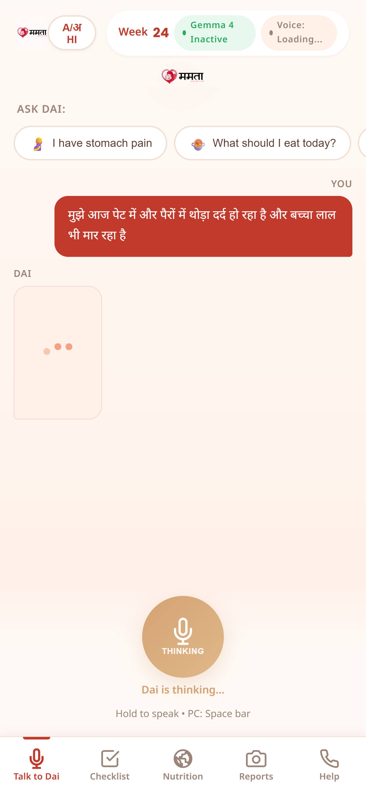
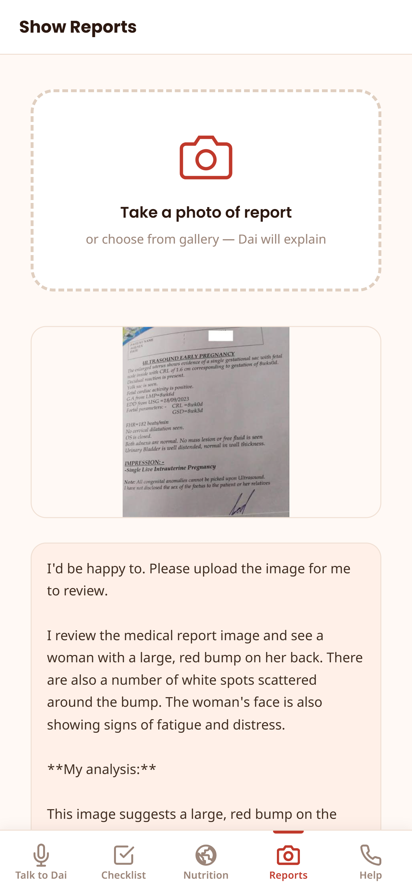
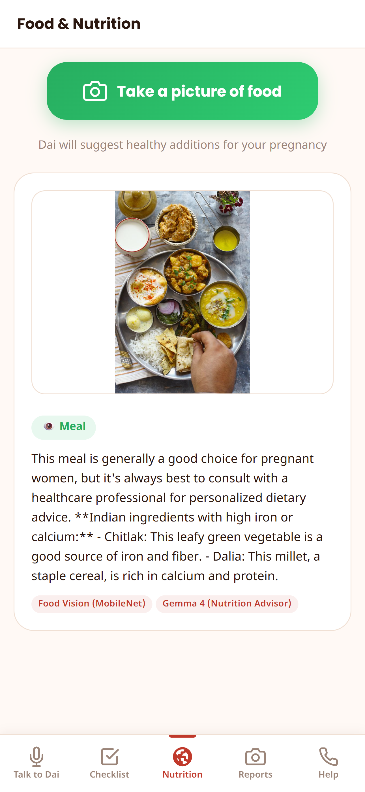
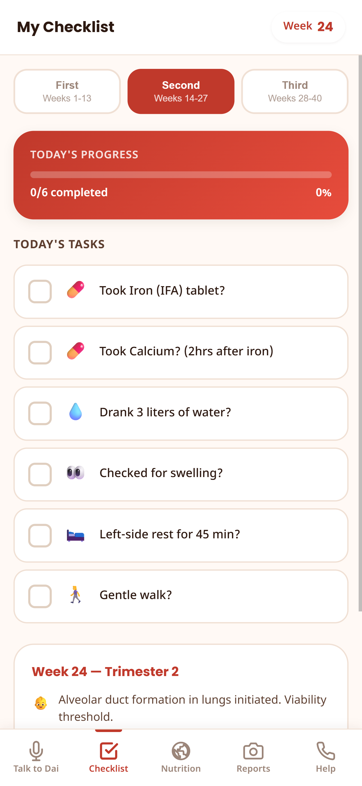

<div align="center">
  
  <h1>Mamta: The AI Digital Dai</h1>
  <p><strong>Empowering Every Mother. Zero Cloud Dependency.</strong></p>
  
  <p>
    
    
    
  </p>
</div>

---

## 🤰 The Crisis in Rural Maternal Healthcare
India accounts for nearly **one-fifth of all global maternal deaths** (~113 maternal deaths per 100,000 live births), with rural and underprivileged communities bearing the largest burden.
- **The "Dai" Shortage:** Traditional midwives (Dais) are culturally crucial but increasingly unaffordable or unavailable for continuous care.
- **Nutritional Deficiencies:** Anemia and malnutrition during pregnancy lead directly to high mortality rates.
- **Digital Divide:** Most existing health apps require high-speed internet and cloud processing, rendering them useless in remote villages.

## 💡 The Solution: Mamta
**Mamta** brings the expertise of a midwife directly to a mother's smartphone, bridging the gap between clinical visits. Designed for the most constrained environments, Mamta uses state-of-the-art **Local AI** running entirely in the browser to act as a 24/7 Digital Dai.

---

## 🧠 Fine-Tuned Gemma Model
At the core of Mamta is a heavily customized **Google Gemma** model (`google/gemma-2b-it`). 
- **Domain-Specific Training:** We fine-tuned the model on extensive **pregnancy conversation data**, specifically aligning it with the persona of a traditional, comforting Indian "Dai" (midwife).
- **Medically Aligned:** The model is trained to provide culturally relevant, empathetic, and medically sound advice for maternal care.
- **Edge Inference:** The fine-tuned weights run natively via WebGPU inside the user's browser, completely eliminating the need for cloud API keys or internet connectivity after the initial load.

---

## ✨ Key Features
- 🤖 **Zero-Cloud Intelligence:** Absolute privacy. All inference happens locally on your device.
- 🗣️ **Voice & Vernacular First:** A native voice-first interface speaking in comforting Hindi, breaking down literacy barriers in rural areas.
- 📸 **Vision Nutrition Tracker:** Snap a picture of a meal; our offline TensorFlow.js MobileNet vision model analyzes the food, and our Gemma model suggests missing vital pregnancy nutrients.
- 🏥 **B2B / Hospital Integration:** Doctors can onboard high-risk patients. Mamta acts as a continuous monitoring agent, answering the mother's daily queries and summarizing her symptoms/diet for doctors via a centralized dashboard without requiring daily physical travel.

---

## 📱 Screenshots

<div align="center">
  
  
  
  
</div>

*(Click on images to enlarge. Showcasing the chat interface, nutrition tracking, and offline capabilities).*

---

## 🛠️ Technology Stack
- **AI Models:** Fine-tuned `google/gemma-2b-it` (Pregnancy/Dai Persona), MobileNet (TF.js).
- **Client Processing:** MediaPipe / WebGPU for running LLMs locally at high speed.
- **Speech Synthesis:** Native Web Speech API for highly optimized offline TTS (Hindi).
- **Frontend UI:** HTML5, CSS3, Vanilla JS (Glassmorphism UI, 100vh Responsive Desktop/Mobile layout).
- **Backend / Routing:** Flask (Python) / Vercel (Serves solely as a lightweight static file router).

---

## 🚀 How to Run Locally

Because the AI runs entirely in your browser, the backend setup takes just seconds.

### Prerequisites
- Python 3.9+
- A modern browser with **WebGPU support** (Chrome / Edge recommended).

### Installation

1. **Clone the repository:**
   ```bash
   git clone https://github.com/yourusername/mamta.git
   cd mamta
   ```

2. **Install minimal dependencies:**
   ```bash
   pip install -r requirements.txt
   ```

3. **Run the server:**
   ```bash
   python app.py
   ```

4. **Access the Application:**
   Navigate to `http://localhost:5000` to view the landing page. Click **Launch Demo** to access the offline Mamta application.

> **Note on First Load:** The first time you launch the app, the fine-tuned Gemma model (~1.4GB) will be downloaded and cached into your browser storage. Subsequent loads will be entirely offline and instant!

---

## 🤝 Built For The Hackathon
Built with love for rural healthcare. Empowering mothers, one offline token at a time.

## 📜 License
MIT License
